# **Laboratorio de Infraestructura Proxmox**

Este proyecto consiste en un laboratorio de infraestructura virtualizada desplegado sobre **Proxmox VE**. El entorno simula una red empresarial pequeña, integrando **servidores Linux y Windows**, autenticación centralizada, servicios de red y administración remota.

## **Descripción General**

Este proyecto presenta un laboratorio de infraestructura virtualizada desplegado sobre **Proxmox VE**, diseñado para simular un entorno empresarial básico. El laboratorio integra **servidores Windows y Linux**, servicios de dominio, asignación automática de direcciones IP y administración remota.

El objetivo principal es demostrar conocimientos prácticos en virtualización, redes, Active Directory y documentación técnica mediante un entorno funcional y validado.

---

## **Objetivos**

Los objetivos de este proyecto son:

- Implementar un entorno virtualizado utilizando **Proxmox VE**.
- Configurar **Windows Server 2016** como el controlador de dominio.
- Implementar los servicios de **Active Directory, DNS, DHCP y Escritorio Remoto (RDP)**.
- Desplegar un **Ubuntu Server** con servicios SSH y Web.
- Unir un **cliente Windows 7** al dominio.
- Validar la conectividad y el funcionamiento de los servicios.
- Documentar la infraestructura con diagramas y evidencias.

---

## **Arquitectura**

La infraestructura se encuentra alojada sobre **Proxmox VE**, utilizando una red bridge (`vmbr0`) dentro de la red `192.168.3.0/24`.

Windows Server 2016 actúa como servidor central, proporcionando servicios de dominio y red, mientras que Ubuntu Server ofrece servicios Linux. Un cliente Windows 7 consume los servicios de red mediante DHCP y se autentica contra el dominio.

---

## **Máquinas Virtuales**

A continuación se describen las máquinas virtuales utilizadas en el laboratorio:

### **Ubuntu Server**

| Dirección IP    | Servicios           | Rol                            |
|-----------------|---------------------|--------------------------------|
| 192.168.3.16   | SSH y Servidor Web  | Servidor de servicios Linux    |

- **Descripción**: Ubuntu Server proporciona acceso SSH y un servidor web (Apache o similar) para alojar aplicaciones y servicios web.

---

### **Windows Server 2016**

| Dirección IP    | Servicios                                  | Rol                                   |
|-----------------|-------------------------------------------|----------------------------------------|
| 192.168.3.18   | Servicios de Active Directory              | Controlador de dominio y servicios de red|
|                 | DNS, DHCP                                  |                                        |
|                 | Escritorio Remoto (RDP)                    |                                        |
|                 | Dominio: Portafolio.local, Usuario: jose1 |                                        |

- **Descripción**: Windows Server 2016 actúa como el controlador de dominio, proporcionando autenticación centralizada (Active Directory), servicios DNS, DHCP y Escritorio Remoto para la administración del entorno.

---

### **Windows 7 (Cliente)**

| Dirección IP    | Configuración                                              | Rol                            |
|-----------------|-------------------------------------------------------------|---------------------------------|
| Asignada por DHCP| Unido al dominio `portafolio.local` con el usuario `Jose1` | Cliente del dominio            |

- **Descripción**: El cliente Windows 7 está unido al dominio `portafolio.local` y está configurado para utilizar los servicios de red proporcionados por el controlador de dominio Windows Server 2016.

---

## **Características Claves**

A continuación, se describen las características clave de la infraestructura:

- Entorno virtualizado utilizando **Proxmox VE** para una gestión eficiente de recursos.
- Implementación de **Active Directory** para autenticación centralizada y gestión de usuarios.
- Servicios de **DNS y DHCP** configurados en Windows Server 2016 para gestionar la asignación de direcciones en la red.
- Administración remota del servidor utilizando **RDP** (Protocolo de Escritorio Remoto).
- **Ubuntu Server** ofreciendo servicios **SSH** y **Web** para acceso remoto y alojamiento web.
- **Windows 7** cliente unido al dominio para autenticación centralizada y acceso a servicios de red.
- Asignación automática de direcciones IP a los clientes mediante DHCP.
- Integración sin problemas de sistemas **Linux** y **Windows** dentro de la misma red.
- Documentación completa con diagramas de red y pruebas de funcionamiento.

---

## **Evidencia**

A continuación se muestran algunas capturas de pantalla que muestran la configuración y el funcionamiento del sistema:

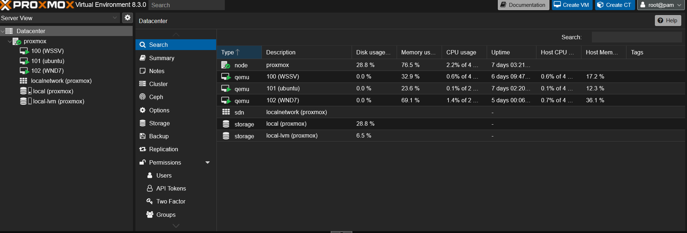

- **Descripción**: Vista del panel de Proxmox VE mostrando la configuración de las máquinas virtuales.

- **Descripción**: Página web alojada en el servidor Ubuntu.

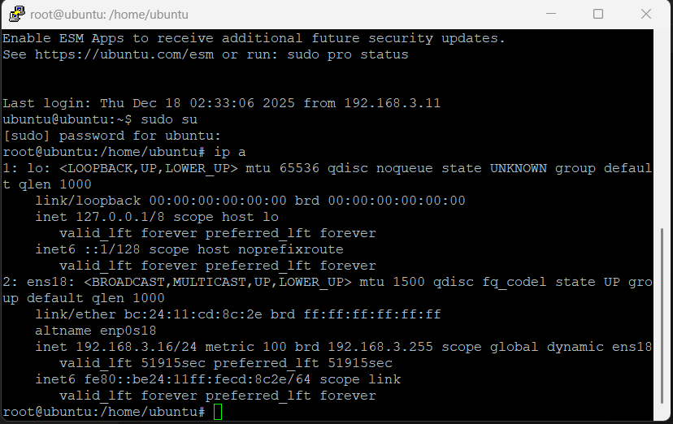

- **Descripción**: Dirección IP del servidor Ubuntu.

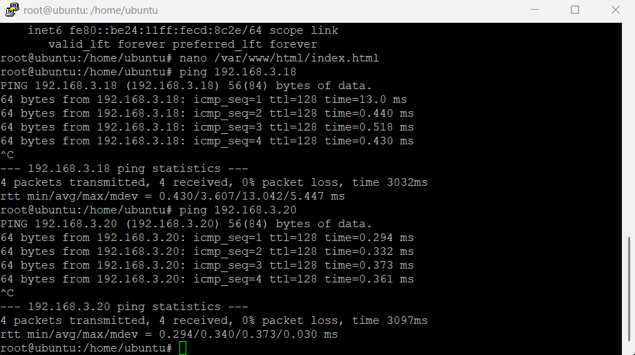

- **Descripción**: Prueba de ping desde el servidor Ubuntu a Windows Server 2016 para comprobar la conectividad de la red.

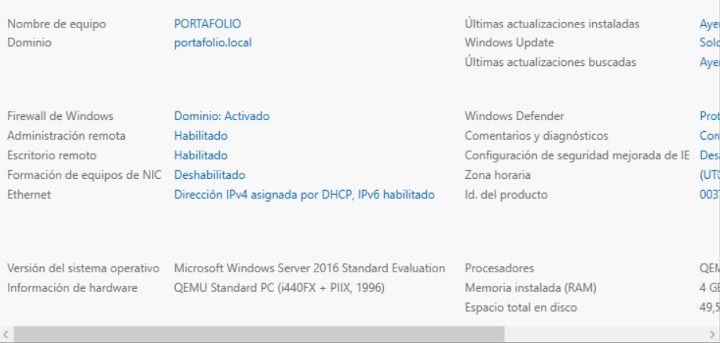

- **Descripción**: Configuración de Active Directory en Windows Server 2016.

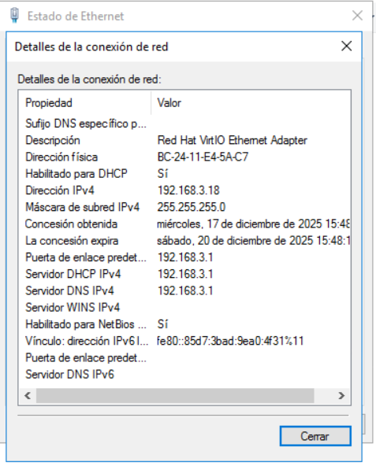

- **Descripción**: Configuración de IP del servidor Windows Server 2016.

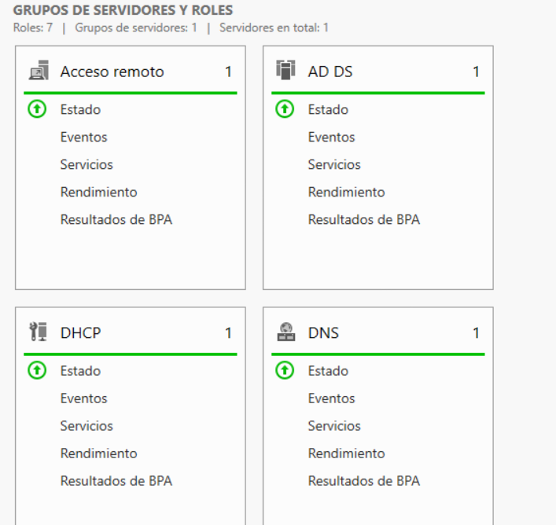

- **Descripción**: Roles asignados al Windows Server 2016, como controlador de dominio, servicios DNS y DHCP.

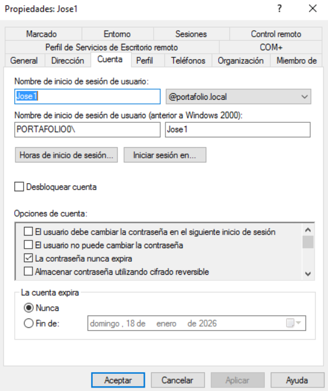

- **Descripción**: Creación de un usuario en Active Directory para autenticación.

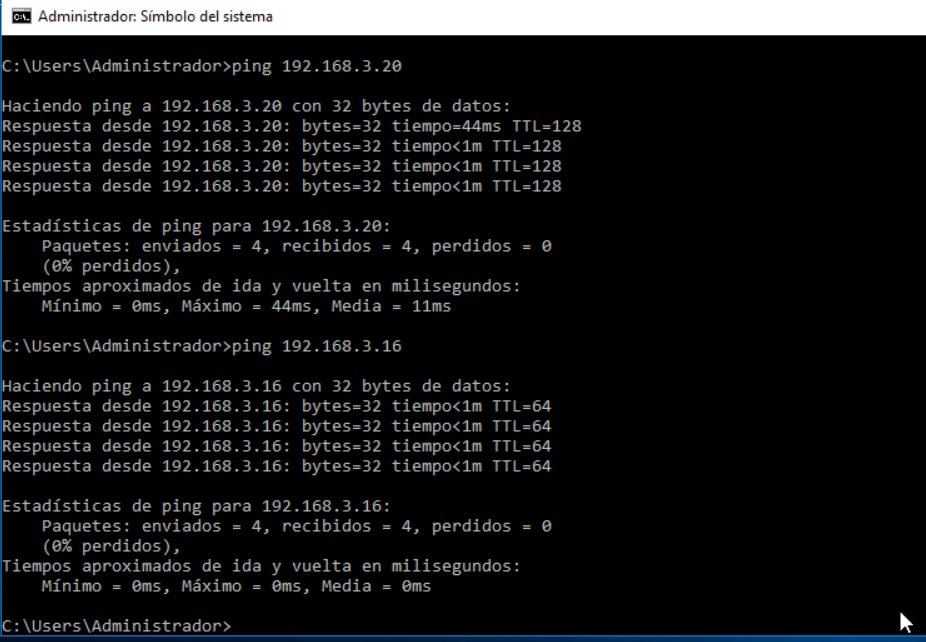

- **Descripción**: Prueba de ping desde un cliente (por ejemplo, Windows 7) a Windows Server 2016.

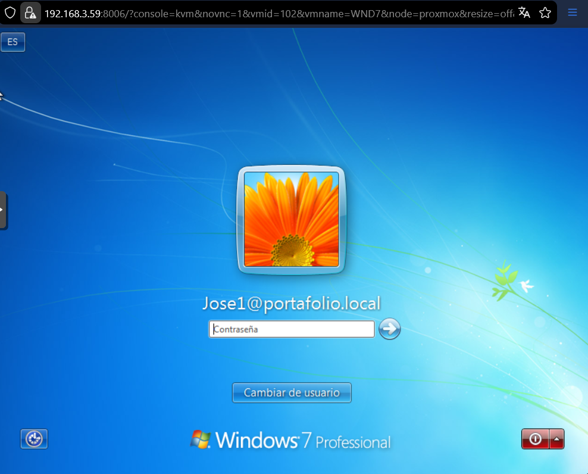

- **Descripción**: Inicio de sesión de usuario en la máquina cliente Windows 7.

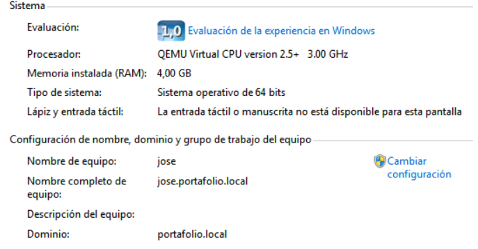

- **Descripción**: Cliente Windows 7 unido al dominio `portafolio.local` con éxito.

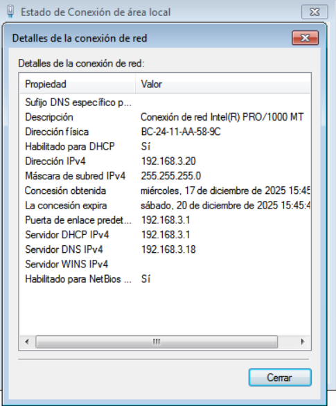

- **Descripción**: Configuración de IP del cliente Windows 7.

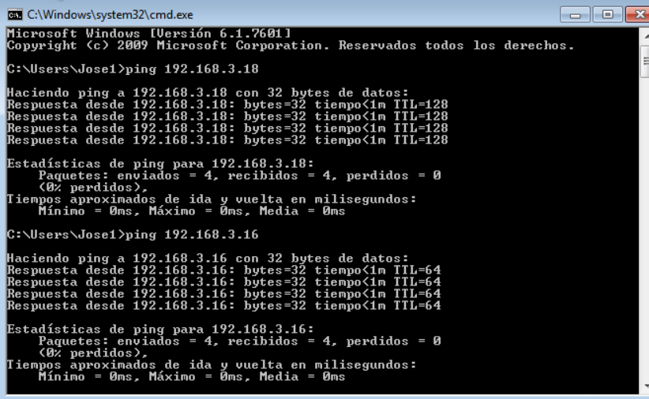

- **Descripción**: Prueba de ping desde el cliente Windows 7 para verificar la conectividad al controlador de dominio.

